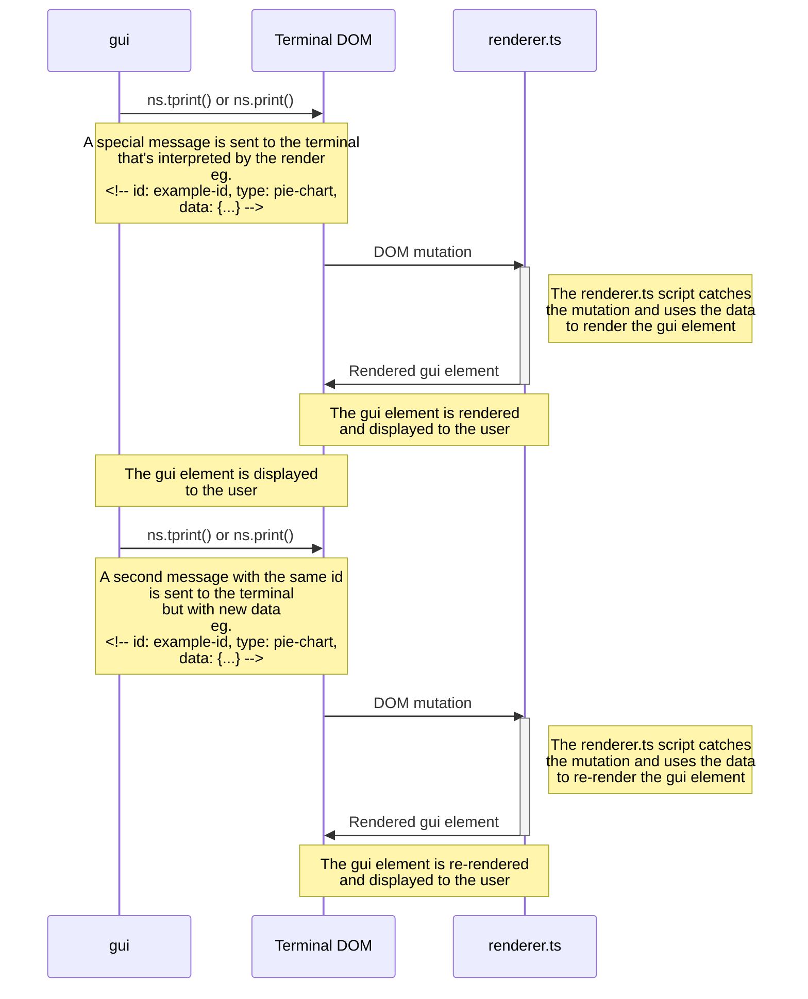

<h1 align="center">
  💻 Bit Burner GUI
</h1>

## 📝 Description
A collection of scripts to help with rendering gui elements in Bit Burner.

## ❓ Explanation
The scripts in this repository work by catching all changes to the terminal outputs and logs and then uses the data provided in the message to render or re-render the gui elements.



This schema assures that the gui elements are alaways up to date and don't need to be rendered in line like 
```
script.ts > [x   ] (t=0)
script.ts > [xx  ] (t=1)
script.ts > [xxx ] (t=2)
script.ts > [xxxx] (t=3)
```
and can save their state to the terminal output and can be re-rendered with their state when a log is closed and re-opened.

## ❗️ Edge Cases
- The bit burner terminal and log capacities are limited so the DOM equivalent of the gui elements will need to be updated if it reaches the limit
- The gui elements to DOM mappings will need to be updated if the terminal or log is cleared
